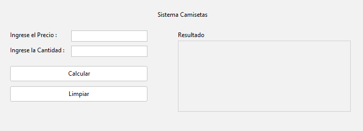
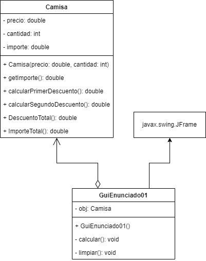

## 🔙 [Volver a Semana 1](../)

---

# 🛍️ Actividad 01 - Semana 1

---

## 📄 Enunciado

Una tienda ha puesto en oferta la venta de camisas ofreciendo un descuento, por temporada de verano, denominado **7% + 7%**. Los cálculos se efectúan de la siguiente manera:

- El **importe de la compra** es igual al producto del precio de la camisa por la cantidad de unidades adquiridas.
- El **importe del primer descuento** es igual al 7% del importe de la compra.
- El **importe del segundo descuento** es igual al 7% de lo que queda de restar el importe de la compra menos el importe del primer descuento.
- El **importe del descuento total** es igual a la suma de los dos descuentos anteriores.
- El **importe por pagar** es igual al importe de la compra menos el importe del descuento total.

---

## 🖼️ Diseño de la Interfaz



---

## 📊 Diagrama UML



---

## 💻 Código Fuente

### 🔹 Clase `Camisa`

```java
class Camisa {

    private double precio;
    private int cantidad;
    private double importe;

    public Camisa(double precio, int cantidad) {
        this.precio = precio;
        this.cantidad = cantidad;
        this.importe = precio * cantidad;
    }

    public double getImporte() {
        return importe;
    }

    public double calcularPrimerDescuento() {
        return this.importe * 0.07;
    }

    public double calcularSegundoDescuento() {
        double primerDescuento = this.importe - calcularPrimerDescuento();

        return primerDescuento * 0.07;
    }

    public double DescuentoTotal() {
        return calcularPrimerDescuento() + calcularSegundoDescuento();
    }

    public double ImporteTotal() {
        return this.importe - DescuentoTotal();
    }
}
```

### 🔹 Clase `GuiEnunciado01` - Metodo `calcular()`

```java
private void Calcular() {
    try {
        double precio = Double.parseDouble(TxtPrecio.getText());
        int cantidad = Integer.parseInt(TxtCantidad.getText());

        if (cantidad <= 0) {
            JOptionPane.showMessageDialog(this,
                    "La cantidad debe ser mayor a 0.",
                    "Cantidad inválida",
                    JOptionPane.WARNING_MESSAGE);

            Limpiar();

            return;
        }

        Obj = new Camisa(precio, cantidad);

        double importe = Obj.getImporte();
        double desc1 = Obj.calcularPrimerDescuento();
        double desc2 = Obj.calcularSegundoDescuento();
        double descTotal = Obj.DescuentoTotal();
        double totalPagar = Obj.ImporteTotal();

        String resultado = ">> Resultados de la compra <<\n\n"
                + "Importe de la compra: S/ " + String.format("%.2f",importe) + "\n"
                + "Primer descuento (7%): S/ " + String.format("%.2f",desc1) + "\n"
                + "Segundo descuento (7%): S/ " + String.format("%2f", desc2) + "\n"
                + "Descuento total: S/ " + String.format("%.2f",descTotal) + "\n"
                + "Total a pagar: S/ " + String.format("%.2f",totalPagar);

        TxtResultado.setText(resultado);

    } catch (NumberFormatException e) {
        JOptionPane.showMessageDialog(this,
                "Error: Ingrese valores válidos. \n- Precio debe serun número decimal.\n- Cantidad debe ser un númeroentero.",
                "Error de entrada",
                JOptionPane.ERROR_MESSAGE);

        Limpiar();
    }
}
```

### 🔹 Clase `GuiEnunciado01` - Metodo `limpiar()`

```java
private void Limpiar() {
    TxtCantidad.setText("");
    TxtPrecio.setText("");
    TxtResultado.setText("");
}
```