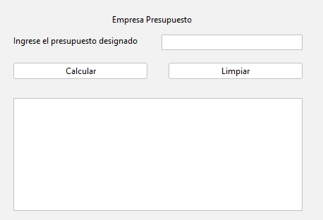
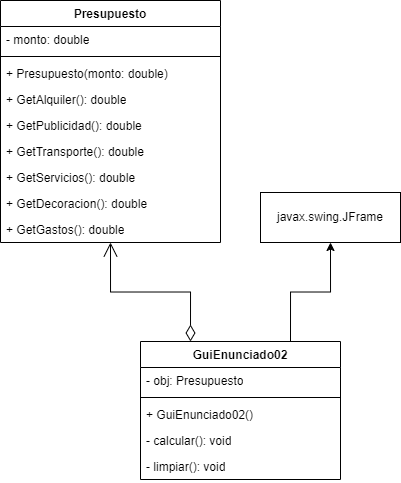

## 🔙 [Volver a Semana 1](../README.md)

---

# 🧾 Actividad 02 - Distribución del Presupuesto

---

## 📄 Enunciado

Una empresa expondrá sus productos en una feria. La empresa considera que el monto total de dinero a invertir estará distribuido de la siguiente manera:

| **Rubro**                         | **Porcentaje** |
|-----------------------------------|----------------|
| Alquiler de espacio en la feria   | 23%            |
| Publicidad                        | 7%             |
| Transporte                        | 26%            |
| Servicios feriales                | 12%            |
| Decoración                        | 21%            |
| Gastos varios                     | 11%            |

> 💡 **Objetivo**: Diseñar un programa que determine cuánto gastará la empresa en cada rubro, en base a un monto total de inversión ingresado por el usuario.

---

## 🖼️ Diseño de la Interfaz



---

## 📊 Diagrama UML



---

## 💻 Código Fuente

### 🔹 Clase `Presupuesto`

```java
class Presupuesto {

    private double monto;

    public Presupuesto(double monto) {
        this.monto = monto;
    }

    public double GetAlquiler() {
        return this.monto * 0.23;
    }

    public double GetPublicidad() {
        return this.monto * 0.07;
    }

    public double GetTransporte() {
        return this.monto * 0.26;
    }

    public double GetServicios() {
        return this.monto * 0.12;
    }

    public double GetDecoracion() {
        return this.monto * 0.21;
    }

    public double GetGastos() {
        return this.monto * 0.11;
    }
}
```

### 🔹 Clase `GuiEnunciado02` - Metodo `calcular()`

```java
private void Calcular() {
    try {
        double presupuesto = Double.parseDouble(TxtPresupuesto.getText());

        if (presupuesto <= 0) {
            JOptionPane.showMessageDialog(this,
                    "El Presupuesto debe ser mayor a 0.",
                    "Presupuesto inválida",
                    JOptionPane.WARNING_MESSAGE);

            Limpiar();

            return;
        }

        Obj = new Presupuesto(presupuesto);

        double alquiler = Obj.GetAlquiler();
        double publicidad = Obj.GetPublicidad();
        double transporte = Obj.GetTransporte();
        double servicios = Obj.GetServicios();
        double decoracion = Obj.GetDecoracion();
        double gastos = Obj.GetGastos();

        String resultado = ">> La distribucion presupuesto asignado es<<\n\n"
                + "Alquiler de Espacio en la Feria (23%): S/ " +String.format("%.2f", alquiler) + "\n"
                + "Publicidad (7%): S/ " + String.format("%.2f",publicidad) + "\n"
                + "Transporte (26%): S/ " + String.format("%.2f",transporte) + "\n"
                + "Servicios Feriales (12%): S/ " + String.format("%2f", servicios) + "\n"
                + "Decoracion (21%): S/ " + String.format("%.2f",decoracion)
                + "Gastos Varios (11%): S/ " + String.format("%.2f",gastos);

        TxtResultado.setText(resultado);

    } catch (NumberFormatException e) {
        JOptionPane.showMessageDialog(this,
                "Error: Ingrese valores válidos. \n- Presupuesto debeser un decimal.",
                "Error de entrada",
                JOptionPane.ERROR_MESSAGE);

        Limpiar();
    }
}
```

### 🔹 Clase `GuiEnunciado02` - Metodo `limpiar()`

```java
private void Limpiar() {
    TxtResultado.setText("");
    TxtPresupuesto.setText("");
}
```