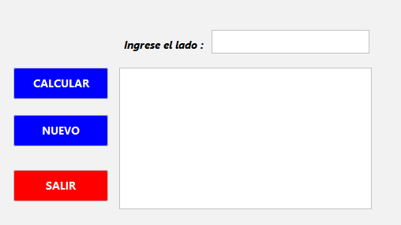
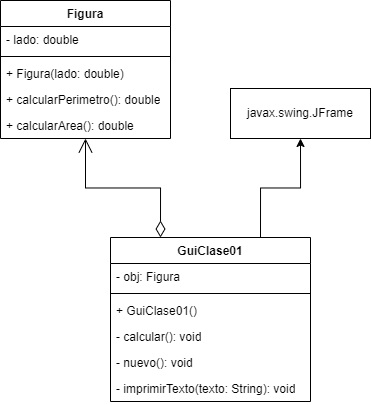

## 🔙 [Volver a Semana 1](../)

---

# 🧮 Clase - Semana 1

Este proyecto consiste en una aplicación para calcular el **área** y el **perímetro** de un cuadrado, utilizando **Lenguaje Java**, el **IDE NetBeans** y el gestor de proyectos **Maven**.

---

## 📄 Enunciado

> Realizar un programa que halle el área y perímetro de un cuadrado, utilizando **Lenguaje Java**, el **IDE NetBeans** y el marco de gestión de proyectos de software **Maven**.

---

## 🧩 Diseño de la Interfaz



---

## 📊 Diagrama UML



---

## 💻 Código Fuente

### 🔹 Clase `Figura`

```java
public class Figura {

    private double lado;

    public Figura(double lado) {
        this.lado = lado;
    }

    public double calcularPerimetro() {
        return 4 * this.lado;
    }

    public double calcularArea() {
        return this.lado * this.lado;
    }
}
```

### 🔹 Clase `GuiClase01` - Metodo `calcular()`

```java
private void calcular() {
    try {
        double lado = Double.parseDouble(txtLado.getText());

        if (lado <= 0) {
            JOptionPane.showMessageDialog(this,
                    "El ladod debe ser mayor a 0.",
                    "Lado inválido",
                    JOptionPane.WARNING_MESSAGE);

            txtLado.setText("");
            txtResultado.setText("");

            return;
        }

        obj = new Figura(lado);

        double area = obj.calcularArea();
        double perimetro = obj.calcularPerimetro();

        imprimirTexto(">> Resultado <<");
        imprimirTexto("");
        imprimirTexto("Perimetro : " + perimetro);
        imprimirTexto("Area : " + area);
    } catch (NumberFormatException e) {
        JOptionPane.showMessageDialog(this,
                "Error: Ingrese valores válidos. \n- Lado debe ser un número decimal.",
                "Error de entrada",
                JOptionPane.ERROR_MESSAGE);

        txtLado.setText("");
        txtResultado.setText("");
    }
}
```

### 🔹 Clase `GuiClase01` - Metodo `nuevo()`

```java
private void nuevo() {
    txtLado.setText("");
    txtResultado.setText("");
}
```

### 🔹 Clase `GuiClase01` - Metodo `imprimirTexto()`

```java
private void imprimirTexto(String texto) {
    txtResultado.append(texto + "\n");
}
```

### 🔹 Clase `GuiClase01` - Metodo `salir()`

```java
private void salir() {
    System.exit(0);
}
```