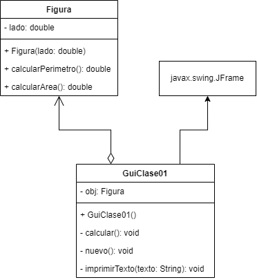
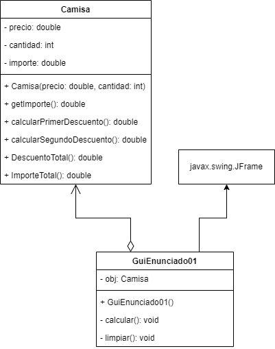
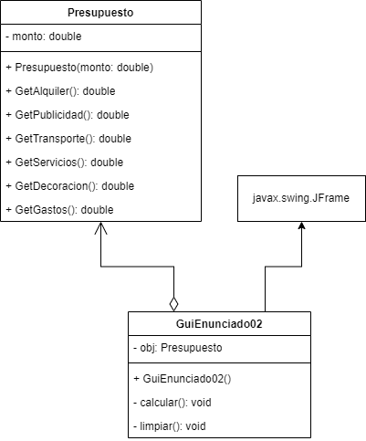

# Semana 1

En esta semana, el contenido está dividido en dos partes principales: **Clases** y **Actividad**. Cada sección incluye el enunciado, el diagrama UML y el código correspondiente.

---

## Clase

### Enunciado

Realizar un programa que halle el área y perímetro de cuadrado, utilizando Lenguaje Java, el IDE NetBeans y el marco de gestión de proyectos de software Maven.

### Diseño


### Diagrama UML



### Código

<details>
<summary><strong>Figura</strong></summary>

```java
public class Figura {

    private double lado;

    public Figura(double lado) {
        this.lado = lado;
    }

    public double calcularPerimetro() {
        return 4 * this.lado;
    }

    public double calcularArea() {
        return this.lado * this.lado;
    }
}
```

</details>
<details> <summary><strong>GuiClase01 - calcular()</strong></summary>

```java
private void calcular() {
    try {
        double lado = Double.parseDouble(txtLado.getText());

        if (lado <= 0) {
            JOptionPane.showMessageDialog(this,
                    "El ladod debe ser mayor a 0.",
                    "Lado inválido",
                    JOptionPane.WARNING_MESSAGE);

            txtLado.setText("");
            txtResultado.setText("");

            return;
        }

        obj = new Figura(lado);

        double area = obj.calcularArea();
        double perimetro = obj.calcularPerimetro();

        imprimirTexto(">> Resultado <<");
        imprimirTexto("");
        imprimirTexto("Perimetro : " + perimetro);
        imprimirTexto("Area : " + area);
    } catch (NumberFormatException e) {
        JOptionPane.showMessageDialog(this,
                "Error: Ingrese valores válidos. \n- Lado debe ser un número decimal.",
                "Error de entrada",
                JOptionPane.ERROR_MESSAGE);

        txtLado.setText("");
        txtResultado.setText("");
    }
}
```

</details>
<details> <summary><strong>GuiClase01 - nuevo()</strong></summary>

```java
private void nuevo() {
    txtLado.setText("");
    txtResultado.setText("");
}
```

</details>
<details> <summary><strong>GuiClase01 - imprimirTexto()</strong></summary>

```java
private void imprimirTexto(String texto) {
    txtResultado.append(texto + "\n");
}
```

</details>
<details> <summary><strong>GuiClase01 - salir()</strong></summary>

```java
private void salir() {
    System.exit(0);
}
```

---

## Actividad 01

### Enunciado

Una tienda ha puesto en oferta la venta de camisas ofreciendo un descuento, por temporada de verano, denominado **7% + 7%**. Los cálculos se efectúan de la siguiente manera:

- El **importe de la compra** es igual al producto del precio de la camisa por la cantidad de unidades adquiridas.
- El **importe del primer descuento** es igual al 7% del importe de la compra.
- El **importe del segundo descuento** es igual al 7% de lo que queda de restar el importe de la compra menos el importe del primer descuento.
- El **importe del descuento total** es igual a la suma de los dos descuentos anteriores.
- El **importe por pagar** es igual al importe de la compra menos el importe del descuento total.

### Diseño


### Diagrama UML



### Código

<details>
<summary><strong>Camisa</strong></summary>

```java
class Camisa {

    private double precio;
    private int cantidad;
    private double importe;

    public Camisa(double precio, int cantidad) {
        this.precio = precio;
        this.cantidad = cantidad;
        this.importe = precio * cantidad;
    }

    public double getImporte() {
        return importe;
    }

    public double calcularPrimerDescuento() {
        return this.importe * 0.07;
    }

    public double calcularSegundoDescuento() {
        double primerDescuento = this.importe - calcularPrimerDescuento();

        return primerDescuento * 0.07;
    }

    public double DescuentoTotal() {
        return calcularPrimerDescuento() + calcularSegundoDescuento();
    }

    public double ImporteTotal() {
        return this.importe - DescuentoTotal();
    }
}
```

<details>
<summary><strong>GuiEnunciado01 - calcular()</strong></summary>

```java
private void Calcular() {
    try {
        double precio = Double.parseDouble(TxtPrecio.getText());
        int cantidad = Integer.parseInt(TxtCantidad.getText());

        if (cantidad <= 0) {
            JOptionPane.showMessageDialog(this,
                    "La cantidad debe ser mayor a 0.",
                    "Cantidad inválida",
                    JOptionPane.WARNING_MESSAGE);

            Limpiar();

            return;
        }

        Obj = new Camisa(precio, cantidad);

        double importe = Obj.getImporte();
        double desc1 = Obj.calcularPrimerDescuento();
        double desc2 = Obj.calcularSegundoDescuento();
        double descTotal = Obj.DescuentoTotal();
        double totalPagar = Obj.ImporteTotal();

        String resultado = ">> Resultados de la compra <<\n\n"
                + "Importe de la compra: S/ " + String.format("%.2f",importe) + "\n"
                + "Primer descuento (7%): S/ " + String.format("%.2f",desc1) + "\n"
                + "Segundo descuento (7%): S/ " + String.format("%2f", desc2) + "\n"
                + "Descuento total: S/ " + String.format("%.2f",descTotal) + "\n"
                + "Total a pagar: S/ " + String.format("%.2f",totalPagar);

        TxtResultado.setText(resultado);

    } catch (NumberFormatException e) {
        JOptionPane.showMessageDialog(this,
                "Error: Ingrese valores válidos. \n- Precio debe serun número decimal.\n- Cantidad debe ser un númeroentero.",
                "Error de entrada",
                JOptionPane.ERROR_MESSAGE);

        Limpiar();
    }
}
```

<details>
<summary><strong>GuiEnunciado01 - limpiar()</strong></summary>

```java
private void Limpiar() {
    TxtCantidad.setText("");
    TxtPrecio.setText("");
    TxtResultado.setText("");
}
```

---

## Actividad 02

### Enunciado

Una empresa expondrá sus productos en una feria. La empresa considera que el monto total de dinero a invertir estará distribuido de la siguiente manera:

| **Rubro**                       | **Porcentaje** |
| ------------------------------- | -------------- |
| Alquiler de espacio en la feria | 23%            |
| Publicidad                      | 7%             |
| Transporte                      | 26%            |
| Servicios feriales              | 12%            |
| Decoración                      | 21%            |
| Gastos varios                   | 11%            |

Dado el monto total de dinero a invertir, diseñe un programa que determine cuánto gastará la empresa en cada rubro.

### Diseño


### Diagrama UML



### Código

<details>
<summary><strong>Presupuesto</strong></summary>

```java
class Presupuesto {

    private double monto;

    public Presupuesto(double monto) {
        this.monto = monto;
    }

    public double GetAlquiler() {
        return this.monto * 0.23;
    }

    public double GetPublicidad() {
        return this.monto * 0.07;
    }

    public double GetTransporte() {
        return this.monto * 0.26;
    }

    public double GetServicios() {
        return this.monto * 0.12;
    }

    public double GetDecoracion() {
        return this.monto * 0.21;
    }

    public double GetGastos() {
        return this.monto * 0.11;
    }
}
```

<details>
<summary><strong>GuiEnunciado02 - calcular()</strong></summary>

```java
private void Calcular() {
    try {
        double presupuesto = Double.parseDouble(TxtPresupuesto.getText());

        if (presupuesto <= 0) {
            JOptionPane.showMessageDialog(this,
                    "El Presupuesto debe ser mayor a 0.",
                    "Presupuesto inválida",
                    JOptionPane.WARNING_MESSAGE);

            Limpiar();

            return;
        }

        Obj = new Presupuesto(presupuesto);

        double alquiler = Obj.GetAlquiler();
        double publicidad = Obj.GetPublicidad();
        double transporte = Obj.GetTransporte();
        double servicios = Obj.GetServicios();
        double decoracion = Obj.GetDecoracion();
        double gastos = Obj.GetGastos();

        String resultado = ">> La distribucion presupuesto asignado es<<\n\n"
                + "Alquiler de Espacio en la Feria (23%): S/ " +String.format("%.2f", alquiler) + "\n"
                + "Publicidad (7%): S/ " + String.format("%.2f",publicidad) + "\n"
                + "Transporte (26%): S/ " + String.format("%.2f",transporte) + "\n"
                + "Servicios Feriales (12%): S/ " + String.format("%2f", servicios) + "\n"
                + "Decoracion (21%): S/ " + String.format("%.2f",decoracion)
                + "Gastos Varios (11%): S/ " + String.format("%.2f",gastos);

        TxtResultado.setText(resultado);

    } catch (NumberFormatException e) {
        JOptionPane.showMessageDialog(this,
                "Error: Ingrese valores válidos. \n- Presupuesto debeser un decimal.",
                "Error de entrada",
                JOptionPane.ERROR_MESSAGE);

        Limpiar();
    }
}
```

<details>
<summary><strong>GuiEnunciado02 - limpiar()</strong></summary>

```java
private void Limpiar() {
    TxtResultado.setText("");
    TxtPresupuesto.setText("");
}
```
