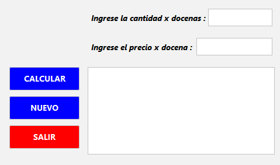
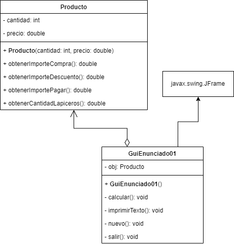

## 🔙 [Volver a Semana 2](../)

---

# 🛍️ Actividad 01 - Semana 2

---

## 📄 Enunciado

Una tienda ha puesto en oferta la venta de un producto ofreciendo un porcentaje de descuento sobre el importe de la compra, de acuerdo con la siguiente tabla:

| **Docenas adquiridas** | **Descuento** |
|------------------------|---------------|
| ≥ 10                   | 20%           |
| < 10                   | 10%           |

---

Adicionalmente, la tienda obsequia lapiceros de acuerdo con la siguiente tabla:

| **Importe a pagar** | **Lapiceros**           |
|---------------------|--------------------------|
| ≥ 200               | 2 por cada docena adquirida |
| < 200               | 0                        |

---

📌 **Objetivo**:  
Dado el precio de la docena y la cantidad de docenas adquiridas, diseñe un programa que determine:

- El **importe de la compra**
- El **importe del descuento**
- El **importe a pagar**
- La **cantidad de lapiceros de obsequio**

---

## 🖼️ Diseño de la Interfaz



---

## 📊 Diagrama UML



---

## 💻 Código Fuente

### 🔹 Clase `Producto`

```java
class Producto {
    
    private int cantidad;
    private double precio;
    
    public Producto(int cantidad, double precio) {
        this.cantidad = cantidad;
        this.precio = precio;
    }
    
    public double obtenerImporteCompra() {
        return precio * cantidad;
    }
    
    public double obtenerImporteDescuento() {
        if (cantidad >= 10) {
            return precio * 0.2;
        }
        
        return precio * 0.1;
    }
    
    public double obtenerImportePagar() {
        return obtenerImporteCompra() - obtenerImporteDescuento();
    }
    
    public int obtenerCantidadLapiceros() {
        if (obtenerImportePagar() >= 200) {
            return 2;
        }
        
        return 0;
    }
}
```

### 🔹 Clase `GuiEnunciado01` - Metodo `calcular()`

```java
private void calcular() {
    try {
        int cantidad = Integer.parseInt(txtCantidad.getText());
        double precio = Double.parseDouble(txtPrecio.getText());
            
        if (precio <= 0 || cantidad <= 0) {
            JOptionPane.showMessageDialog(this,
                    "El precio y la cantidad deben ser mayor a 0.",
                    "Precio o Cantidad inválida",
                    JOptionPane.WARNING_MESSAGE);
                
            txtCantidad.setText("");
            txtPrecio.setText("");
                
            return;
        }
            
        obj = new Producto(cantidad, precio);
            
        imprimirTexto(">> Resultados de la compra <<");
        imprimirTexto("");
        imprimirTexto("Importe Compra : " + String.format("%.2f", obj.obtenerImporteCompra()));
        imprimirTexto("Importe Descuento : " + String.format("%.2f", obj.obtenerImporteDescuento()));
        imprimirTexto("Importe a Pagar : " + String.format("%.2f", obj.obtenerImportePagar()));
        imprimirTexto("Docenas Lapiceros Regalados : " + obj.obtenerCantidadLapiceros());
        imprimirTexto("");
            
        txtCantidad.setText("");
        txtPrecio.setText("");
    } catch (NumberFormatException e) {
        JOptionPane.showMessageDialog(this,
                "Error: Ingrese valores válidos. \n-Cantidad debe ser un número entero \n- Precio debe ser un número decimal.",
                "Error de entrada",
                JOptionPane.ERROR_MESSAGE);
            
        txtCantidad.setText("");
        txtPrecio.setText("");
    }
}
```

### 🔹 Clase `GuiEnunciado01` - Metodo `nuevo()`

```java
private void nuevo() {
    txtCantidad.setText("");
    txtPrecio.setText("");
    txtResultado.setText("");
}
```

### 🔹 Clase `GuiEnunciado01` - Metodo `imprimirTexto()`

```java
private void imprimirTexto(String texto) {
    txtResultado.append(texto + "\n");
}
```

### 🔹 Clase `GuiEnunciado01` - Metodo `salir()`

```java
private void salir() {
    System.exit(0);
}
```