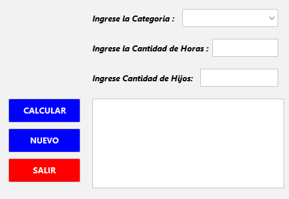
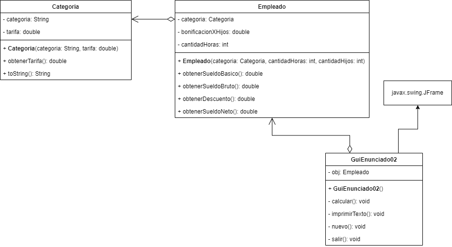

## 🔙 [Volver a Semana 2](../)

---

# 🧾 Actividad 02

---

## 📄 Enunciado

Una empresa expondrá sus productos en una feria. La empresa considera que el monto total de dinero a invertir estará distribuido de la siguiente manera:

| **Rubro**                         | **Porcentaje** |
|-----------------------------------|----------------|
| Alquiler de espacio en la feria   | 23%            |
| Publicidad                        | 7%             |
| Transporte                        | 26%            |
| Servicios feriales                | 12%            |
| Decoración                        | 21%            |
| Gastos varios                     | 11%            |

> 💡 **Objetivo**: Diseñar un programa que determine cuánto gastará la empresa en cada rubro, en base a un monto total de inversión ingresado por el usuario.

---

## 🖼️ Diseño de la Interfaz



---

## 📊 Diagrama UML



---

## 💻 Código Fuente

### 🔹 Clase `Categoria`

```java
class Categoria {

    private String categoria;
    private double tarifa;

    public Categoria(String categoria, double tarifa) {
        this.categoria = categoria;
        this.tarifa = tarifa;
    }

    public double obtenerTarifa() {
        return tarifa;
    }

    @Override
    public String toString() {
        return categoria;
    }
}
```

### 🔹 Clase `Empleado`

```java
class Empleado {

    private Categoria categoria;
    private double bonificacionXHijos;
    private int cantidadHoras;

    public Empleado(Categoria categoria, int cantidadHoras, int cantidadHijos) {
        this.categoria = categoria;
        this.cantidadHoras = cantidadHoras;
        if (cantidadHijos <= 3) {
            this.bonificacionXHijos = 40.5;
            return;
        }

        this.bonificacionXHijos = 35;
    }

    public double obtenerSueldoBasico() {
        return cantidadHoras * categoria.obtenerTarifa();
    }

    public double obtenerSueldoBruto() {
        return obtenerSueldoBasico() + bonificacionXHijos;
    }

    public double obtenerDescuento() {
        double sueldoBruto = obtenerSueldoBruto();

        if (sueldoBruto >= 3500) {
            return sueldoBruto * 0.135;
        }

        return sueldoBruto * 0.1;
    }

    public double obtenerSueldoNeto() {
        return obtenerSueldoBruto() - obtenerDescuento();
    }
}
```

### 🔹 Clase `GuiEnunciado02` - Metodo `calcular()`

```java
private void calcular() {
    try {
        Categoria categoria = (Categoria) cmbCategoria.getSelectedItem();
        int horas = Integer.parseInt(txtHoras.getText());
        int hijos = Integer.parseInt(txtHijos.getText());

        if (horas <= 0 || hijos < 0) {
            JOptionPane.showMessageDialog(this,
                    "La cantidad de horas deben ser mayor a 0. \n La cantidad de hijos deben ser mayor o igual a 0.",
                    "Horas o Hijos inválidos",
                    JOptionPane.WARNING_MESSAGE);

            txtHijos.setText("");
            txtHoras.setText("");
            cmbCategoria.setSelectedIndex(0);

            return;
        }

        obj = new Empleado(categoria, horas, hijos);

        imprimirTexto(">> Resultados <<");
        imprimirTexto("");
        imprimirTexto("Sueldo Basico : " + String.format("%.2f", obj.obtenerSueldoBasico()));
        imprimirTexto("Sueldo Bruto : " + String.format("%.2f", obj.obtenerSueldoBruto()));
        imprimirTexto("Descuento : " + String.format("%.2f", obj.obtenerDescuento()));
        imprimirTexto("Sueldo Neto : " + String.format("%.2f", obj.obtenerSueldoNeto()));
        imprimirTexto("");

        txtHijos.setText("");
        txtHoras.setText("");
        cmbCategoria.setSelectedIndex(0);
    } catch (NumberFormatException e) {
        JOptionPane.showMessageDialog(this,
                "Error: Ingrese valores válidos. \n-Cantidad debe ser un número entero \n- Precio debe ser un número decimal.",
                "Error de entrada",
                JOptionPane.ERROR_MESSAGE);

        txtHijos.setText("");
        txtHoras.setText("");
        cmbCategoria.setSelectedIndex(0);
    }
}
```

### 🔹 Clase `GuiEnunciado02` - Metodo `nuevo()`

```java
private void nuevo() {
    txtHijos.setText("");
    txtHoras.setText("");
    cmbCategoria.setSelectedIndex(0);
    txtResultado.setText("");
}
```

### 🔹 Clase `GuiEnunciado02` - Metodo `imprimirTexto()`

```java
private void imprimirTexto(String texto) {
    txtResultado.append(texto + "\n");
}
```

### 🔹 Clase `GuiEnunciado02` - Metodo `salir()`

```java
private void salir() {
    System.exit(0);
}
```