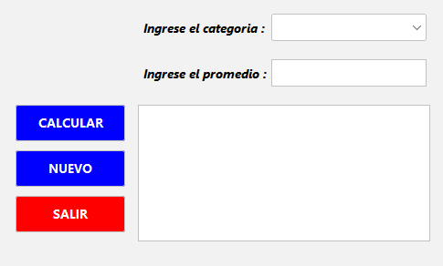
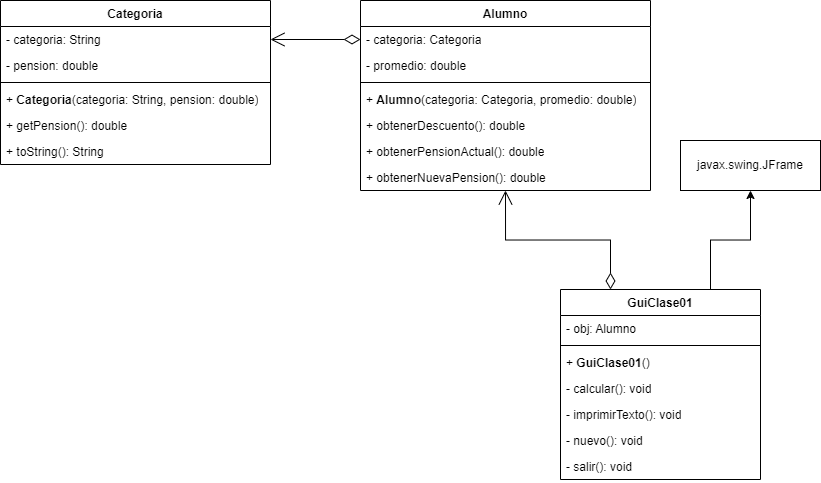

## 🔙 [Volver a Semana 2](../)

---

# 🧮 Clase - Semana 2

---

## 📄 Enunciado

En una universidad de Lima, los alumnos están clasificados en cuatro categorías. A cada categoría le corresponde una pensión mensual distinta, según la siguiente tabla:

| **Categoría** | **Pensión** |
| ------------- | ----------- |
| A             | S/. 550     |
| B             | S/. 500     |
| C             | S/. 460     |
| D             | S/. 400     |

---

Semestralmente, la universidad efectúa rebajas en las pensiones de sus estudiantes a partir del segundo ciclo, basándose en el promedio ponderado del ciclo anterior. El porcentaje de descuento está determinado según la siguiente tabla:

| **Promedio**  | **Descuento**    |
| ------------- | ---------------- |
| 00.0 a 13.99  | No hay descuento |
| 14.00 a 15.99 | 10 %             |
| 16.00 a 17.99 | 12 %             |
| 18.00 a 20.00 | 15 %             |

>💡 **Objetivo**: Dado el promedio ponderado y la categoría de un estudiante, diseñe una aplicación que determine cuánto de rebaja recibirá sobre su pensión actual y a cuánto asciende su nueva pensión.

---

## 🧩 Diseño de la Interfaz



---

## 📊 Diagrama UML



---

## 💻 Código Fuente

### 🔹 Clase `Categoria`

```java
class Categoria {

    private String categoria;
    private double pension;

    public Categoria(String categoria, double pension) {
        this.categoria = categoria;
        this.pension = pension;
    }

    public double getPension() {
        return pension;
    }

    @Override
    public String toString() {
        return categoria;
    }
}
```

### 🔹 Clase `Alumno`

```java
class Alumno {

    private double promedio;
    private Categoria categoria;

    public Alumno(double promedio, Categoria categoria) {
        this.promedio = promedio;
        this.categoria = categoria;
    }

    public double obtenerDescuento() {
        if (this.promedio >= 18) {
            return 0.15 * obtenerPensionActual();
        }

        if (this.promedio >= 16) {
            return 0.12 * obtenerPensionActual();
        }

        if (this.promedio >= 14) {
            return 0.10 * obtenerPensionActual();
        }

        return 0;
    }

    public double obtenerPensionActual() {
        return this.categoria.getPension();
    }

    public double obtenerNuevaPension() {
        return obtenerPensionActual() - obtenerDescuento();
    }
}
```

### 🔹 Clase `GuiClase01` - Metodo `calcular()`

```java
private void calcular() {
    try {
        Categoria categoria = (Categoria) cmbCategoria.getSelectedItem();
        double promedio = Double.parseDouble(txtPromedio.getText());

        if (promedio > 20 && promedio >= 0) {
            JOptionPane.showMessageDialog(this,
                    "El promedio debe ser mayor igual a 0 y menor igual a 20.",
                    "promedio inválido",
                    JOptionPane.WARNING_MESSAGE);

            cmbCategoria.setSelectedIndex(0);
            txtPromedio.setText("");

            return;
        }

        obj = new Alumno(promedio, categoria);

        imprimirTexto(">> Resultado <<");
        imprimirTexto("");
        imprimirTexto("Pension Actual : " + String.format("%.2f", obj.obtenerPensionActual()));
        imprimirTexto("Descuento : " + String.format("%.2f", obj.obtenerDescuento()));
        imprimirTexto("Nueva Pension : " + String.format("%.2f", obj.obtenerNuevaPension()));
        imprimirTexto("");
    } catch (NumberFormatException e) {
        JOptionPane.showMessageDialog(this,
                "Error: Ingrese valores válidos. \n- Promedio debe ser un número decimal.",
                "Error de entrada",
                JOptionPane.ERROR_MESSAGE);

        cmbCategoria.setSelectedIndex(0);
        txtPromedio.setText("");
    }
}
```

### 🔹 Clase `GuiClase01` - Metodo `nuevo()`

```java
private void nuevo() {
    cmbCategoria.setSelectedIndex(0);
    txtPromedio.setText("");
    txtResultado.setText("");
}
```

### 🔹 Clase `GuiClase01` - Metodo `imprimirTexto()`

```java
private void imprimirTexto(String texto) {
    txtResultado.append(texto + "\n");
}
```

### 🔹 Clase `GuiClase01` - Metodo `salir()`

```java
private void salir() {
    System.exit(0);
}
```
