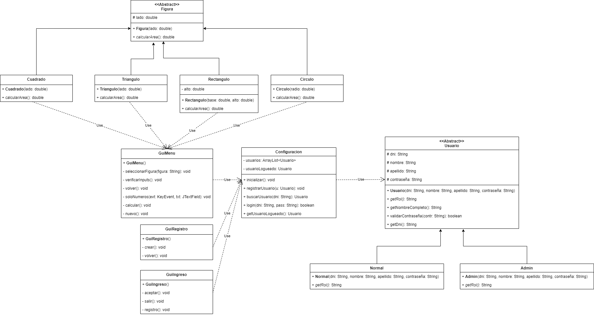

## 🔙 [Volver a Semana 3](../)

---

# 🛍️ Actividad 01 - Semana 3

---

## 📄 Enunciado

Se desea desarrollar un sistema de escritorio con interfaz gráfica que permita la gestión de usuarios a través de un módulo de login y registro. El sistema contempla dos tipos de usuario:

| **Rol**        | **Permisos**                                                                                             |
| -------------- | -------------------------------------------------------------------------------------------------------- |
| Administrador  | Accede al cálculo de área de todas las figuras: **Cuadrado**, **Triángulo**, **Rectángulo**, **Círculo** |
| Usuario normal | Solo accede al cálculo de **Cuadrado** y **Triángulo**.                                                  |

Una vez que el usuario inicia sesión, es redirigido a un menú principal donde podrá seleccionar la figura geométrica deseada para calcular su área. La interfaz se adapta dinámicamente según la figura seleccionada, mostrando únicamente los campos necesarios.

El sistema valida la entrada numérica y responde visualmente al usuario desactivando botones e inputs de forma inteligente, asegurando una experiencia intuitiva.

---

📌 **Objetivo**:  
Diseñar e implementar una aplicación orientada a objetos que permita:

- Registrar e iniciar sesión con control de roles (**admin** / **usuario normal**).
- Validar que el DNI sea único y numérico durante el registro.
- Acceder a un menú gráfico dinámico según el rol del usuario.
- Calcular correctamente el área de diferentes figuras geométricas:
- - 📐 Cuadrado (lado)
- - 📏 Triángulo (base y altura iguales)
- - 📊 Rectángulo (base y altura)
- - ⚪ Círculo (radio)
- Controlar la visibilidad y habilitación de campos y botones según la figura seleccionada.
- Aplicar correctamente los fundamentos de programación orientada a objetos:
- - Uso de clases abstractas
- - Implementación de herencia
- - Aplicación de polimorfismo
- - Encapsulamiento y buenas prácticas de diseño

---

## 🖼️ Diseño de la Interfaz


---

## 📊 Diagrama UML



---

## 💻 Código Fuente

### 🔹 Clase Abstracta `Usuario`

```java
public abstract class Usuario {

    protected String dni;
    protected String nombre;
    protected String apellido;
    protected String contraseña;

    public Usuario(String dni, String nombre, String apellido, String contraseña) {
        this.dni = dni;
        this.nombre = nombre;
        this.apellido = apellido;
        this.contraseña = contraseña;
    }

    public abstract String getRol();

    public String getNombreCompleto() {
        return nombre + " " + apellido;
    }

    public boolean validarContraseña(String contr) {
        return contraseña.equals(contr);
    }

    public String getDni() {
        return dni;
    }
}
```

### 🔹 Clase `Normal`

```java
public class Normal extends Usuario {

    public Normal(String dni, String nombre, String apellido, String contraseña) {
        super(dni, nombre, apellido, contraseña);
    }

    @Override
    public String getRol() {
        return "normal";
    }
}
```

### 🔹 Clase `Admin`

```java
public class Admin extends Usuario {

    public Admin(String dni, String nombre, String apellido, String contraseña) {
        super(dni, nombre, apellido, contraseña);
    }

    @Override
    public String getRol() {
        return "admin";
    }
}
```

### 🔹 Clase `Configuracion`

```java
public class Configuracion {

    private static ArrayList<Usuario> usuarios = new ArrayList<>();
    private static Usuario usuarioLogueado;

    public static void inicializar() {
        usuarios.add(new Admin("12345678", "Adriano", "Admin", "admin123"));
    }

    public static void registrarUsuario(Usuario u) {
        usuarios.add(u);
    }

    public static Usuario buscarUsuario(String dni) {
        for (Usuario u : usuarios) {
            if (u.getDni().equals(dni)) {
                return u;
            }
        }
        return null;
    }

    public static boolean login(String dni, String pass) {
        Usuario u = buscarUsuario(dni);
        if (u != null && u.validarContraseña(pass)) {
            usuarioLogueado = u;
            return true;
        }
        return false;
    }

    public static Usuario getUsuarioLogueado() {
        return usuarioLogueado;
    }
}
```

### 🔹 Clase `Main`

```java
public class Main {

    public static void main(String[] args) {
        Configuracion.inicializar();

        GuiIngreso form = new GuiIngreso();
        form.setVisible(true);
    }
}
```

### 🔹 Clase `GuiIngreso` - Metodo `aceptar()`

```java
private void salir() {
    int respuesta = JOptionPane.showOptionDialog(this, "Estas Seguro de Salir ...", "Salir", JOptionPane.YES_NO_OPTION, JOptionPane.QUESTION_MESSAGE, null, new Object[]{"Si salgo", "No salgo"}, "No salgo");

    if (respuesta == 0) {
        System.exit(0);
    }

    txtDni.requestFocus();
}
```

### 🔹 Clase `GuiIngreso` - Metodo `aceptar()`

```java
private void aceptar() {
    try {
        String dniTexto = txtDni.getText().trim();
        String pass = new String(txtContrasenia.getPassword()).trim();

        if (dniTexto.isEmpty()) {
            JOptionPane.showMessageDialog(this, "Por favor ingresa el DNI", "Campo requerido",
                    JOptionPane.WARNING_MESSAGE);
            txtDni.requestFocus();
            return;
        }

        if (pass.isEmpty()) {
            JOptionPane.showMessageDialog(this, "Por favor ingresa la contraseña", "Campo requerido",
                    JOptionPane.WARNING_MESSAGE);
            txtContrasenia.requestFocus();
            return;
        }

        int dniNumero = Integer.parseInt(dniTexto);

        if (dniTexto.length() != 8) {
            JOptionPane.showMessageDialog(this, "El DNI debe tener exactamente 8 dígitos", "DNI inválido",
                    JOptionPane.WARNING_MESSAGE);
            txtDni.requestFocus();
            return;
        }

        // Intentar login
        if (Configuracion.login(dniTexto, pass)) {
            this.dispose();
            GuiMenu menu = new GuiMenu();
            menu.setVisible(true);
        } else {
            JOptionPane.showMessageDialog(this, "Credenciales incorrectas", "Error de acceso",
                    JOptionPane.ERROR_MESSAGE);
        }

    } catch (NumberFormatException e) {
        JOptionPane.showMessageDialog(this, "El DNI debe ser numérico", "DNI inválido", JOptionPane.WARNING_MESSAGE);
        txtDni.requestFocus();

    }
}
```

### 🔹 Clase `GuiIngreso` - Metodo `registro()`

```java
private void registro() {
    GuiRegistro form = new GuiRegistro(this, true);
    form.setVisible(true);
}
```

### 🔹 Clase `GuiRegistro` - Metodo `crear()`

```java
private void crear() {
    try {
        String dniTexto = txtDni.getText().trim();
        String nombre = txtNombre.getText().trim();
        String apellido = txtApellido.getText().trim();
        String pass = new String(txtContrasena.getPassword()).trim();
        String repPass = new String(txtRepetirContrasena.getPassword()).trim();

        if (dniTexto.isEmpty() || nombre.isEmpty() || apellido.isEmpty() || pass.isEmpty() || repPass.isEmpty()) {
            JOptionPane.showMessageDialog(this, "Todos los campos son obligatorios", "Campo vacío",
                    JOptionPane.WARNING_MESSAGE);
            return;
        }

        int dniNumero = Integer.parseInt(dniTexto);

        if (dniTexto.length() != 8) {
            JOptionPane.showMessageDialog(this, "El DNI debe tener exactamente 8 dígitos", "DNI inválido",
                    JOptionPane.WARNING_MESSAGE);
            txtDni.requestFocus();
            return;
        }

        if (Configuracion.buscarUsuario(dniTexto) != null) {
            JOptionPane.showMessageDialog(this, "El DNI ya está registrado", "Usuario existente",
                    JOptionPane.WARNING_MESSAGE);
            txtDni.requestFocus();
            return;
        }

        if (!pass.equals(repPass)) {
            JOptionPane.showMessageDialog(this, "Las contraseñas no coinciden", "Error de contraseña",
                    JOptionPane.WARNING_MESSAGE);
            return;
        }

        Usuario nuevo = new Normal(dniTexto, nombre, apellido, pass);
        Configuracion.registrarUsuario(nuevo);

        JOptionPane.showMessageDialog(this, "Usuario registrado correctamente");
        this.dispose();

    } catch (NumberFormatException e) {
        JOptionPane.showMessageDialog(this, "El DNI debe ser numérico", "DNI inválido", JOptionPane.WARNING_MESSAGE);
        txtDni.requestFocus();

    }
}
```

### 🔹 Clase `GuiRegistro` - Metodo `volver()`

```java
private void volver() {
    this.dispose();
}
```

### 🔹 Clase `GuiMenu` - Metodo `configuracion()`

```java
private void configuracion() {
    Usuario u = Configuracion.getUsuarioLogueado();

    if (u != null && u.getRol().equals("normal")) {
        tbtnRectangulo.setVisible(false);
        tbtnCirculo.setVisible(false);
    }

    tbtnCuadrado.setSelected(true);
    lblNombre.setText("Bienvenido " + Configuracion.getUsuarioLogueado().getNombreCompleto());

    lblDato2.setVisible(false);
    txtDato2.setVisible(false);

    btnCalcular.setEnabled(false);
    btnNuevo.setEnabled(false);

    lblResultado.setVisible(false);
    txtResultado.setVisible(false);
}
```

### 🔹 Clase `GuiMenu` - Metodo `seleccionarFigura()`

```java
private void seleccionarFigura(String figura) {
    switch (figura.toLowerCase()) {
        case "cuadrado":
            lblTitulo.setText("CALCULAR CUADRADO");
            lblDato1.setText("Ingrese el lado:");
            lblDato2.setVisible(false);
            txtDato2.setVisible(false);
            break;

        case "triangulo":
            lblTitulo.setText("CALCULAR TRIANGULO");
            lblDato1.setText("Ingrese la base:");
            lblDato2.setVisible(false);
            txtDato2.setVisible(false);
            break;

        case "circulo":
            lblTitulo.setText("CALCULAR CIRCULO");
            lblDato1.setText("Ingrese el radio:");
            lblDato2.setVisible(false);
            txtDato2.setVisible(false);
            break;

        case "rectangulo":
            lblTitulo.setText("CALCULAR RECTANGULO");
            lblDato1.setText("Ingrese la base:");
            lblDato2.setText("Ingrese la altura:");
            lblDato2.setVisible(true);
            txtDato2.setVisible(true);
            break;
    }

    txtDato1.setText("");
    txtDato2.setText("");
    txtResultado.setText("");

    btnCalcular.setEnabled(false);
    btnNuevo.setEnabled(false);

    txtDato1.setEnabled(true);
    txtDato2.setEnabled(true);
}
```

### 🔹 Clase `GuiMenu` - Metodo `verificarInputs()`

```java
private void verificarInputs() {
    boolean esRectangulo = tbtnRectangulo.isSelected();

    boolean valido1 = !txtDato1.getText().trim().isEmpty();
    boolean valido2 = !txtDato2.getText().trim().isEmpty();

    if (esRectangulo) {
        btnCalcular.setEnabled(valido1 && valido2);
    } else {
        btnCalcular.setEnabled(valido1);
    }
}
```

### 🔹 Clase `GuiMenu` - Metodo `volver()`

```java
private void volver() {
    int respuesta = JOptionPane.showOptionDialog(
        this,
        "Estas Seguro de Salir ...",
        "Salir",
        JOptionPane.YES_NO_OPTION,
        JOptionPane.QUESTION_MESSAGE,
        null,
        new Object[]{"Si salgo", "No salgo"},
        "No salgo"
    );

    if (respuesta == 0) {
        this.dispose();
        new GuiIngreso().setVisible(true);
    }
}
```

### 🔹 Clase `GuiMenu` - Metodo `soloNumeros()`

```java
private void soloNumeros(java.awt.event.KeyEvent evt, javax.swing.JTextField txt) {
    char c = evt.getKeyChar();

    if (!Character.isDigit(c) && c != '.' && c != java.awt.event.KeyEvent.VK_BACK_SPACE) {
        evt.consume();
    }

    if (c == '.' && txt.getText().contains(".")) {
        evt.consume();
    }
}
```

### 🔹 Clase `GuiMenu` - Metodo `calcular()`

```java
private void calcular() {
    double val1 = Double.parseDouble(txtDato1.getText());
    double val2 = txtDato2.isVisible() ? Double.parseDouble(txtDato2.getText()) : 0;

    Figura figura = null;

    if (tbtnCuadrado.isSelected()) {
        figura = new Cuadrado(val1);
    } else if (tbtnTriangulo.isSelected()) {
        figura = new Triangulo(val1);
    } else if (tbtnRectangulo.isSelected()) {
        figura = new Rectangulo(val1, val2);
    } else if (tbtnCirculo.isSelected()) {
        figura = new Circulo(val1);
    }

    if (figura != null) {
        double area = figura.calcularArea();
        txtResultado.setText(String.format("%.2f", area));

        lblResultado.setVisible(true);
        txtResultado.setVisible(true);

        txtDato1.setEnabled(false);
        txtDato2.setEnabled(false);
        btnCalcular.setEnabled(false);
        btnNuevo.setEnabled(true);
    }
}
```

### 🔹 Clase `GuiMenu` - Metodo `nuevo()`

```java
private void nuevo() {
    txtDato1.setText("");
    txtDato2.setText("");
    txtResultado.setText("");

    txtDato1.setEnabled(true);
    txtDato2.setEnabled(true);

    btnCalcular.setEnabled(false);
    btnNuevo.setEnabled(false);

    lblResultado.setVisible(false);
    txtResultado.setVisible(false);

    lblResultado.setVisible(false);
    txtResultado.setVisible(false);

    txtDato1.requestFocus();
}

```
