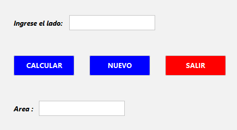
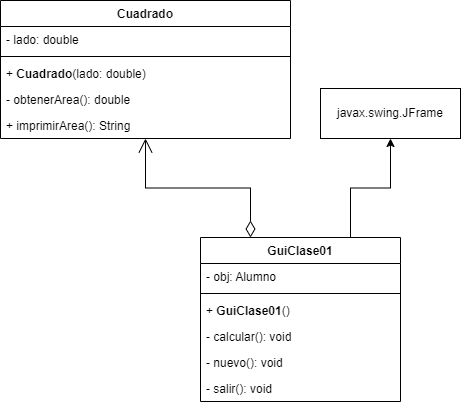

## 🔙 [Volver a Semana 3](../)

---

# 🧮 Clase - Semana 3

---

## 📄 Enunciado

**Realizar un programa que halle el área de cuadrado**, utilizando **Programación Orientada a Objetos**, **Lenguaje Java**, el **IDE NetBeans** y el marco de gestión de proyectos de software **Maven**.

---

## 🧩 Diseño de la Interfaz



---

## 📊 Diagrama UML



---

## 💻 Código Fuente

### 🔹 Clase `Cuadrado`

```java
class Cuadrado {

    private double lado;

    public Cuadrado(double lado) {
        this.lado = lado;
    }

    private double obtenerArea() {
        return (double) Math.pow(lado, 2);
    }

    public String imprimirArea() {
        return String.format("%.2f", obtenerArea());
    }
}
```

### 🔹 Clase `GuiClase01` - Metodo `calcular()`

```java
private void calcular() {
    try {
        double lado = Double.parseDouble(txtLado.getText());

        if (lado <= 0) {
            JOptionPane.showMessageDialog(this,
                    "El lado debe ser mayor a 0.",
                    "Lado inválido",
                    JOptionPane.WARNING_MESSAGE);

            txtLado.setText("");
            txtResultado.setText("");

            return;
        }

        obj = new Cuadrado(lado);

        txtResultado.setText(obj.imprimirArea());
    } catch (NumberFormatException e) {
        JOptionPane.showMessageDialog(this,
                "Error: Ingrese valores válidos. \n- Lado debe ser un número decimal.",
                "Error de entrada",
                JOptionPane.ERROR_MESSAGE);

        txtLado.setText("");
        txtResultado.setText("");
    }
}
```

### 🔹 Clase `GuiClase01` - Metodo `nuevo()`

```java
private void nuevo() {
    txtLado.setText("");
    txtResultado.setText("");
    txtLado.hasFocus();
}
```

### 🔹 Clase `GuiClase01` - Metodo `salir()`

```java
private void salir() {
    System.exit(0);
}
```
