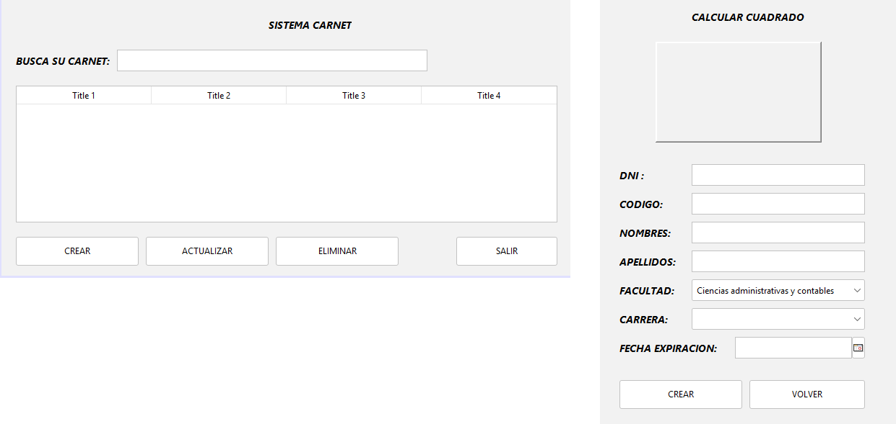
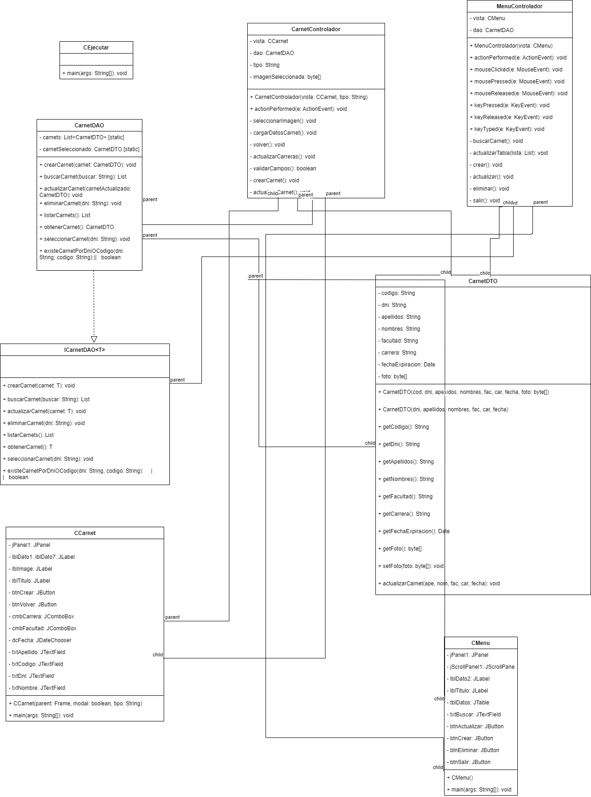

## 🔙 [Volver a Semana 5](../)

---

# 🛍️ Actividad 01 - Semana 4

---

## 📄 Enunciado

Durante esta semana se desarrolló un sistema de gestión de carnets, reestructurado completamente bajo el patrón de arquitectura **MVC (Modelo-Vista-Controlador)**.

El proyecto permite administrar información de usuarios a través de una interfaz gráfica. Desde un **menú principal**, el usuario puede realizar operaciones como **crear, buscar, actualizar y eliminar carnets**. La información se visualiza en una tabla y puede filtrarse mediante un campo de búsqueda por DNI.

Cada carnet contiene datos clave como:  
**DNI, Código, Nombres, Apellidos, Facultad, Carrera y Fecha de Expiración**, además de una imagen representativa.

---

📌 **Objetivo**:  
Aplicar el patrón MVC para organizar correctamente las responsabilidades en la aplicación:

- **Vista:** interfaz gráfica intuitiva, con validaciones visuales y control de botones dinámico.
- **Modelo (DAO y DTO):** manejo de la lógica de datos, validaciones y almacenamiento temporal.
- **Controlador:** manejo de eventos y coordinación entre la vista y el modelo.

El sistema incluye las siguientes funcionalidades:

- ✅ Crear un nuevo carnet con validación de campos obligatorios y formato correcto.
- 🔍 Buscar por número de DNI en tiempo real.
- ♻️ Modificar datos existentes del carnet.
- 🗑️ Eliminar registros.
- 📄 Visualizar toda la información en una tabla.
- 🎨 Carga y vista previa de imagen del carnet.

Además, se aplican conceptos clave de **Programación Orientada a Objetos** como herencia, encapsulamiento, uso de constructores, y separación clara de responsabilidades.

---

## 🖼️ Diseño de la Interfaz



---

## 📊 Diagrama UML



---

## 💻 Código Fuente

### 🔹 Package `Controlador` - Clase `IngresarControlador` - Metodo `IngresarControlador()`

```java
public IngresarControlador(CIngresarVista vista) {
    this.vista = vista;
    this.usuarioDAO = new UsuarioDAO();

    this.vista.btnAceptar.addActionListener(this);
    this.vista.btnRegistrar.addActionListener(this);
    this.vista.btnSalir.addActionListener(this);
}
```

### 🔹 Package `Controlador` - Clase `IngresarControlador` - Metodo `salir()`

```java
private void salir() {
    int respuesta = JOptionPane.showOptionDialog(
        vista,
        "¿Estás Seguro de Salir ...?",
        "Salir",
        JOptionPane.YES_NO_OPTION,
        JOptionPane.QUESTION_MESSAGE,
        null,
        new Object[]{"Sí salgo", "No salgo"},
        "No salgo"
    );

    if (respuesta == 0) {
        System.exit(0);
    }

    vista.txtDni.requestFocus();
}
```

### 🔹 Package `Controlador` - Clase `IngresarControlador` - Metodo `registrar()`

```java
private void registrar() {
    CRegistrarVista registro = new CRegistrarVista(vista, true);
    registro.setVisible(true);
}
```

### 🔹 Package `Controlador` - Clase `IngresarControlador` - Metodo `aceptar()`

```java
private void aceptar() {
    try {
        String dni = vista.txtDni.getText();
        String contrasena = vista.txtContrasenia.getText();

        if (dni.isEmpty()) {
            JOptionPane.showMessageDialog(vista, "Por favor ingresa el DNI", "Campo requerido", JOptionPane.WARNING_MESSAGE);
            vista.txtDni.requestFocus();
            return;
        }

        if (contrasena.isEmpty()) {
            JOptionPane.showMessageDialog(vista, "Por favor ingresa la contraseña", "Campo requerido", JOptionPane.WARNING_MESSAGE);
            vista.txtContrasenia.requestFocus();
            return;
        }

        int dniNumero = Integer.parseInt(dni);

        if (dni.length() != 8) {
            JOptionPane.showMessageDialog(vista, "El DNI debe tener exactamente 8 dígitos", "DNI inválido", JOptionPane.WARNING_MESSAGE);
            vista.txtDni.requestFocus();
            return;
        }

        if (usuarioDAO.ingresarUsuario(dni, contrasena)) {
            vista.dispose();
            new CMenuVista().setVisible(true);
        } else {
            JOptionPane.showMessageDialog(vista, "Credenciales incorrectas", "Error de acceso", JOptionPane.ERROR_MESSAGE);
        }

    } catch (NumberFormatException e) {
        JOptionPane.showMessageDialog(vista, "El DNI debe ser numérico", "DNI inválido", JOptionPane.WARNING_MESSAGE);
        vista.txtDni.requestFocus();
    }
}
```

### 🔹 Package `Controlador` - Clase `MenuControlador` - Metodo `MenuControlador()`

```java
public MenuControlador(CMenuVista vista) {
    this.vista = vista;

    // Suscripción a eventos
    this.vista.btnVolver.addActionListener(this);
    this.vista.btnCalcular.addActionListener(this);
    this.vista.btnNuevo.addActionListener(this);

    this.vista.btnCuadrado.addActionListener(this);
    this.vista.btnTriangulo.addActionListener(this);
    this.vista.btnRectangulo.addActionListener(this);
    this.vista.btnCirculo.addActionListener(this);

    this.vista.txtDato1.addKeyListener(this);
    this.vista.txtDato2.addKeyListener(this);
}
```

### 🔹 Package `Controlador` - Clase `MenuControlador` - Metodo `actionPerformed()`

```java
@Override
public void actionPerformed(ActionEvent e) {
    Object source = e.getSource();

    if (source == vista.btnVolver) {
        volver();
    } else if (source == vista.btnCalcular) {
        calcular();
    } else if (source == vista.btnNuevo) {
        nuevo();
    } else {
        if (source == vista.btnCuadrado) {
            seleccionarFigura("cuadrado");
        } else if (source == vista.btnTriangulo) {
            seleccionarFigura("triangulo");
        } else if (source == vista.btnRectangulo) {
            seleccionarFigura("rectangulo");
        } else if (source == vista.btnCirculo) {
            seleccionarFigura("circulo");
        }
    }
}
```

### 🔹 Package `Controlador` - Clase `MenuControlador` - Metodo `seleccionarFigura()`

```java
private void seleccionarFigura(String figura) {
    switch (figura.toLowerCase()) {
        case "cuadrado":
            vista.lblTitulo.setText("CALCULAR CUADRADO");
            vista.lblDato1.setText("Ingrese el lado:");
            mostrarCampo2(false);
            break;

        case "triangulo":
            vista.lblTitulo.setText("CALCULAR TRIANGULO");
            vista.lblDato1.setText("Ingrese la base:");
            vista.lblDato2.setText("Ingrese la altura:");
            mostrarCampo2(true);
            break;

        case "rectangulo":
            vista.lblTitulo.setText("CALCULAR RECTANGULO");
            vista.lblDato1.setText("Ingrese la base:");
            vista.lblDato2.setText("Ingrese la altura:");
            mostrarCampo2(true);
            break;

        case "circulo":
            vista.lblTitulo.setText("CALCULAR CIRCULO");
            vista.lblDato1.setText("Ingrese el radio:");
            mostrarCampo2(false);
            break;
    }

    resetCampos();
    verificarInputs();
}
```

### 🔹 Package `Controlador` - Clase `MenuControlador` - Metodo `calcular()`

```java
private void calcular() {
    try {
        double val1 = Double.parseDouble(vista.txtDato1.getText());
        double val2 = vista.txtDato2.isVisible() ? Double.parseDouble(vista.txtDato2.getText()) : 0;

        Figura figura = null;

        if (vista.btnCuadrado.isSelected()) {
            figura = new Cuadrado(val1);
        } else if (vista.btnTriangulo.isSelected()) {
            figura = new Triangulo(val1, val2);
        } else if (vista.btnRectangulo.isSelected()) {
            figura = new Rectangulo(val1, val2);
        } else if (vista.btnCirculo.isSelected()) {
            figura = new Circulo(val1);
        }

        if (figura != null) {
            double area = figura.calcularArea();
            vista.txtResultado.setText(String.format("%.2f", area));
            vista.lblResultado.setVisible(true);
            vista.txtResultado.setVisible(true);

            vista.txtDato1.setEnabled(false);
            vista.txtDato2.setEnabled(false);
            vista.btnCalcular.setEnabled(false);
            vista.btnNuevo.setEnabled(true);
        }

    } catch (NumberFormatException ex) {
        JOptionPane.showMessageDialog(vista, "Ingrese valores numéricos válidos.", "Error", JOptionPane.WARNING_MESSAGE);
    }
}
```

### 🔹 Package `Controlador` - Clase `MenuControlador` - Metodo `nuevo()`

```java
private void nuevo() {
    resetCampos();
    vista.txtDato1.setEnabled(true);
    vista.txtDato2.setEnabled(true);
    vista.btnCalcular.setEnabled(false);
    vista.btnNuevo.setEnabled(false);
    vista.txtDato1.requestFocus();
}
```

### 🔹 Package `Controlador` - Clase `MenuControlador` - Metodo `volver()`

```java
private void volver() {
    int respuesta = JOptionPane.showOptionDialog(vista, "¿Estás seguro de volver?", "Salir",
        JOptionPane.YES_NO_OPTION, JOptionPane.QUESTION_MESSAGE, null,
        new Object[]{"Sí", "No"}, "No");

    if (respuesta == 0) {
        vista.dispose();
        // Puedes volver a mostrar la vista de ingreso aquí
    }
}
```

### 🔹 Package `Controlador` - Clase `MenuControlador` - Metodo `mostrarCampo2()`

```java
private void mostrarCampo2(boolean mostrar) {
    vista.lblDato2.setVisible(mostrar);
    vista.txtDato2.setVisible(mostrar);
}
```

### 🔹 Package `Controlador` - Clase `MenuControlador` - Metodo `resetCampos()`

```java
private void resetCampos() {
    vista.txtDato1.setText("");
    vista.txtDato2.setText("");
    vista.txtResultado.setText("");
    vista.lblResultado.setVisible(false);
    vista.txtResultado.setVisible(false);
}
```

### 🔹 Package `Controlador` - Clase `MenuControlador` - Metodo `verificarInputs()`

```java
private void verificarInputs() {
    boolean valido1 = !vista.txtDato1.getText().trim().isEmpty();
    boolean valido2 = !vista.txtDato2.isVisible() || !vista.txtDato2.getText().trim().isEmpty();
    vista.btnCalcular.setEnabled(valido1 && valido2);
}
```

### 🔹 Package `Controlador` - Clase `RegistrarControlador` - Metodo `RegistrarControlador()`

```java
public RegistrarControlador(CRegistrarVista vista) {
    this.vista = vista;
    this.usuarioDAO = new UsuarioDAO();

    // Eventos
    this.vista.btnCrear.addActionListener(this);
    this.vista.btnVolver.addActionListener(this);
}
```

### 🔹 Package `Controlador` - Clase `RegistrarControlador` - Metodo `actionPerformed()`

```java
@Override
public void actionPerformed(ActionEvent e) {
    Object fuente = e.getSource();

    if (fuente == vista.btnCrear) {
        crear();
    } else if (fuente == vista.btnVolver) {
        volver();
    }
}
```

### 🔹 Package `Controlador` - Clase `RegistrarControlador` - Metodo `crear()`

```java
private void crear() {
    try {
        String dni = vista.txtDni.getText().trim();
        String nombre = vista.txtNombre.getText().trim();
        String apellido = vista.txtApellido.getText().trim();
        String pass = new String(vista.txtContrasena.getPassword()).trim();
        String repPass = new String(vista.txtRepetirContrasena.getPassword()).trim();

        if (dni.isEmpty() || nombre.isEmpty() || apellido.isEmpty() || pass.isEmpty() || repPass.isEmpty()) {
            JOptionPane.showMessageDialog(vista, "Todos los campos son obligatorios", "Campo vacío", JOptionPane.WARNING_MESSAGE);
            return;
        }

        if (dni.length() != 8) {
            JOptionPane.showMessageDialog(vista, "El DNI debe tener exactamente 8 dígitos", "DNI inválido", JOptionPane.WARNING_MESSAGE);
            vista.txtDni.requestFocus();
            return;
        }

        // Validación numérica
        Integer.parseInt(dni); // Lanza NumberFormatException si no es numérico

        if (usuarioDAO.BuscarUsuario(dni) != null) {
            JOptionPane.showMessageDialog(vista, "El DNI ya está registrado", "Usuario existente", JOptionPane.WARNING_MESSAGE);
            vista.txtDni.requestFocus();
            return;
        }

        if (!pass.equals(repPass)) {
            JOptionPane.showMessageDialog(vista, "Las contraseñas no coinciden", "Error de contraseña", JOptionPane.WARNING_MESSAGE);
            return;
        }

        UsuarioDTO nuevo = new UsuarioDTO(dni, nombre, apellido, pass, false);
        usuarioDAO.crearUsuario(nuevo);

        JOptionPane.showMessageDialog(vista, "Usuario registrado correctamente");
        vista.dispose();

    } catch (NumberFormatException ex) {
        JOptionPane.showMessageDialog(vista, "El DNI debe ser numérico", "DNI inválido", JOptionPane.WARNING_MESSAGE);
        vista.txtDni.requestFocus();
    }
}
```

### 🔹 Package `Controlador` - Clase `RegistrarControlador` - Metodo `volver()`

```java
private void volver() {
    vista.dispose();
}
```

### 🔹 Package `Main` - Clase `CEjecutar` - Metodo `main()`

```java
public static void main(String[] args) {
    new UsuarioDAO().inicializar();
    new CIngresarVista().setVisible(true);
}
```

### 🔹 Package `Modelo.DAO` - Interfaz `IUsuarioDAO` - Metodo `resetCampos()`

```java
public interface IUsuarioDAO<T> {
    void inicializar();
    void crearUsuario(T usuario);
    boolean ingresarUsuario(String dni, String contrasena);
    T obtenerUsuarioLogueado();
    T BuscarUsuario(String dni);
}
```

### 🔹 Package `Modelo.DAO` - Clase `UsuarioDAO` - Metodo `ingresarUsuario()`

```java
@Override
public boolean ingresarUsuario(String dni, String contrasena) {
    UsuarioDTO u = BuscarUsuario(dni);
    if (u != null && u.compararContrasenas(contrasena)) {
        usuarioLogueado = u;
        return true;
    }
    return false;
}
```

### 🔹 Package `Modelo.DAO` - Clase `UsuarioDAO` - Metodo `obtenerUsuarioLogueado()`

```java
@Override
public UsuarioDTO obtenerUsuarioLogueado() {
    return usuarioLogueado;
}
```

### 🔹 Package `Modelo.DAO` - Clase `UsuarioDAO` - Metodo `crearUsuario()`

```java
@Override
public void crearUsuario(UsuarioDTO usuario) {
    usuarios.add(usuario);
}

```

### 🔹 Package `Modelo.DAO` - Clase `UsuarioDAO` - Metodo `inicializar()`

```java
@Override
public void inicializar() {
    usuarios.add(new UsuarioDTO("75141615", "adriano", "romero", "admin123", true));
}
```

### 🔹 Package `Modelo.DTO` - Clase Abstracta `Figura`

```java
public abstract class Figura {

    public abstract double calcularArea();
}
```

### 🔹 Package `Modelo.DTO` - Clase `Circulo`

```java
public class Circulo extends Figura {

    private double radio;

    public Circulo(double radio) {
        this.radio = radio;
    }

    @Override
    public double calcularArea() {
        return Math.PI * radio * radio;
    }
}
```

### 🔹 Package `Modelo.DTO` - Clase `Cuadrado`

```java
public class Cuadrado extends Figura {

    private double lado;

    public Cuadrado(double lado) {
        this.lado = lado;
    }

    @Override
    public double calcularArea() {
        return lado * lado;
    }
}
```

### 🔹 Package `Modelo.DTO` - Clase `Rectangulo`

```java
public class Rectangulo extends Figura {

    private double base;
    private double altura;

    public Rectangulo(double base, double altura) {
        this.base = base;
        this.altura = altura;
    }

    @Override
    public double calcularArea() {
        return base * altura;
    }
}
```

### 🔹 Package `Modelo.DTO` - Clase `Triangulo`

```java
public class Triangulo extends Figura {

    private double base;
    private double altura;

    public Triangulo(double base, double altura) {
        this.base = base;
        this.altura = altura;
    }

    @Override
    public double calcularArea() {
        return (base * altura) / 2;
    }
}
```

### 🔹 Package `Modelo.DTO` - Clase `UsuarioDTO`

```java
public class UsuarioDTO {

    private String dni;
    private String nombre;
    private String apellido;
    private String contraseña;
    private boolean administrador;

    public UsuarioDTO(String dni, String nombre, String apellido, String contraseña, boolean administrador) {
        this.dni = dni;
        this.nombre = nombre;
        this.apellido = apellido;
        this.contraseña = contraseña;
        this.administrador = administrador;
    }

    public boolean esAdministrador() {
        return administrador;
    }

    public String obtenerDni() {
        return this.dni;
    }

    public boolean compararContrasenas(String contrasenaComparar) {
        return this.contraseña.equals(contrasenaComparar);
    }

    @Override
    public String toString() {
        return nombre + " " + apellido;
    }
}
```

### 🔹 Package `Vista` - Clase `CIngresarVista`

```java
public CIngresarVista() {
    initComponents();
    this.setLocationRelativeTo(null);
    new IngresarControlador(this);
}
```

### 🔹 Package `Vista` - Clase `CMenuVista`

```java
public CMenuVista() {
    initComponents();
    this.setLocationRelativeTo(null);
    new MenuControlador(this);
}
```

### 🔹 Package `Vista` - Clase `CRegistrarVista`

```java
public CRegistrarVista(java.awt.Frame parent, boolean modal) {
    super(parent, modal);
    initComponents();
    this.setLocationRelativeTo(null);
    new RegistrarControlador(this);
}
```
